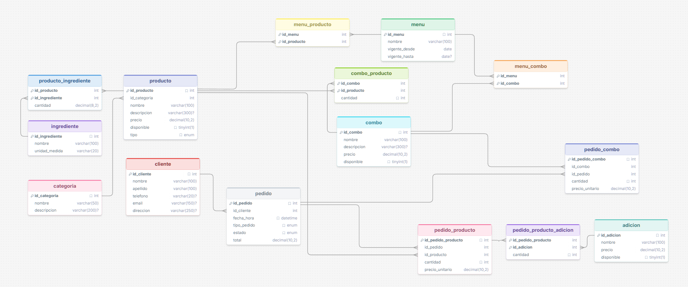

# Pizzería DB — Documentación del Proyecto

### Entidades principales

| Entidad | Descripción |
|---|---|
| `categoria` | Clasificación de productos (pizza, panzarotti, bebida, postre, snack) |
| `producto` | Pizzas, panzarottis y productos no elaborados con precio y tipo |
| `ingrediente` | Materias primas con unidad de medida |
| `producto_ingrediente` | Receta: qué ingredientes y en qué cantidad lleva cada producto elaborado |
| `adicion` | Extras personalizables (queso adicional, salsas, bordes, etc.) |
| `combo` | Paquetes de productos a precio especial |
| `combo_producto` | Composición de cada combo |
| `menu` | Versiones del menú con vigencia |
| `menu_producto / menu_combo` | Ítems activos en cada versión del menú |
| `cliente` | Datos de contacto de los clientes |
| `pedido` | Encabezado del pedido (tipo: en_lugar / para_recoger, estado, total) |
| `pedido_producto` | Líneas de productos individuales por pedido |
| `pedido_producto_adicion` | Adiciones aplicadas a cada línea de producto |
| `pedido_combo` | Líneas de combos por pedido |

---

## Diagrama Lógico / Físico



---

## Consultas SQL

### 1. Productos más vendidos (pizza, panzarottis, bebidas, etc.)

```sql
SELECT
    p.nombre                                        AS producto,
    c.nombre                                        AS categoria,
    SUM(unidades)                                   AS total_vendido
FROM (
    -- Ventas directas
    SELECT id_producto, SUM(cantidad) AS unidades
    FROM pedido_producto
    GROUP BY id_producto

    UNION ALL

    -- Ventas dentro de combos
    SELECT cp.id_producto, SUM(pc.cantidad * cp.cantidad) AS unidades
    FROM pedido_combo pc
    JOIN combo_producto cp ON cp.id_combo = pc.id_combo
    GROUP BY cp.id_producto
) ventas
JOIN producto p    ON p.id_producto  = ventas.id_producto
JOIN categoria c   ON c.id_categoria = p.id_categoria
GROUP BY p.id_producto, p.nombre, c.nombre
ORDER BY total_vendido DESC;
```

---

### 2. Total de ingresos generados por cada combo

```sql
SELECT
    co.nombre                            AS combo,
    SUM(pc.cantidad * pc.precio_unitario) AS ingresos_totales
FROM pedido_combo pc
JOIN combo co ON co.id_combo = pc.id_combo
GROUP BY co.id_combo, co.nombre
ORDER BY ingresos_totales DESC;
```

---

### 3. Pedidos para recoger vs. consumir en la pizzería

```sql
SELECT
    tipo_pedido,
    COUNT(*) AS cantidad_pedidos,
    ROUND(COUNT(*) * 100.0 / SUM(COUNT(*)) OVER (), 2) AS porcentaje
FROM pedido
GROUP BY tipo_pedido;
```

---

### 4. Adiciones más solicitadas en pedidos personalizados
```sql
SELECT
    a.nombre              AS adicion,
    SUM(ppa.cantidad)     AS total_veces_solicitada
FROM pedido_producto_adicion ppa
JOIN adicion a ON a.id_adicion = ppa.id_adicion
GROUP BY a.id_adicion, a.nombre
ORDER BY total_veces_solicitada DESC;
```

---

### 5. Cantidad total de productos vendidos por categoría
```sql
SELECT
    cat.nombre            AS categoria,
    SUM(unidades)         AS total_vendido
FROM (
    SELECT p.id_categoria, SUM(pp.cantidad) AS unidades
    FROM pedido_producto pp
    JOIN producto p ON p.id_producto = pp.id_producto
    GROUP BY p.id_categoria

    UNION ALL

    SELECT p.id_categoria, SUM(pc.cantidad * cp.cantidad) AS unidades
    FROM pedido_combo pc
    JOIN combo_producto cp ON cp.id_combo = pc.id_combo
    JOIN producto p        ON p.id_producto = cp.id_producto
    GROUP BY p.id_categoria
) ventas
JOIN categoria cat ON cat.id_categoria = ventas.id_categoria
GROUP BY cat.id_categoria, cat.nombre
ORDER BY total_vendido DESC;
```

---

### 6. Promedio de pizzas pedidas por cliente
```sql
SELECT ROUND(AVG(pizzas_por_cliente), 2) AS promedio_pizzas_por_cliente
FROM (
    SELECT
        ped.id_cliente,
        SUM(pp.cantidad) AS pizzas_por_cliente
    FROM pedido_producto pp
    JOIN producto p  ON p.id_producto  = pp.id_producto AND p.tipo = 'pizza'
    JOIN pedido ped  ON ped.id_pedido  = pp.id_pedido
    GROUP BY ped.id_cliente
) sub;
```

---

### 7. Total de ventas por día de la semana
```sql
SELECT
    DAYNAME(fecha_hora)   AS dia_semana,
    COUNT(*)              AS num_pedidos,
    SUM(total)            AS ingresos_totales
FROM pedido
GROUP BY DAYNAME(fecha_hora), DAYOFWEEK(fecha_hora)
ORDER BY DAYOFWEEK(fecha_hora);
```
---

### 8. Cantidad de panzarottis vendidos con extra queso
```sql
SELECT 
    p.nombre AS panzarotti,
    SUM(todos.cantidad_vendida) AS vendidos_totales
FROM producto p
JOIN (
    SELECT id_producto, cantidad AS cantidad_vendida
    FROM pedido_producto
    
    UNION ALL
    
    SELECT cp.id_producto, (pc.cantidad * cp.cantidad) AS cantidad_vendida
    FROM pedido_combo pc
    JOIN combo_producto cp ON cp.id_combo = pc.id_combo
) todos ON p.id_producto = todos.id_producto
WHERE p.tipo = 'panzarotti'
GROUP BY p.id_producto, p.nombre
ORDER BY vendidos_totales DESC;
```

---
### 9. Pedidos que incluyen bebidas como parte de un combo

```sql
SELECT DISTINCT
    ped.id_pedido,
    cl.nombre,
    cl.apellido,
    ped.fecha_hora,
    co.nombre AS combo
FROM pedido_combo pc
JOIN combo co          ON co.id_combo  = pc.id_combo
JOIN combo_producto cp ON cp.id_combo  = co.id_combo
JOIN producto p        ON p.id_producto = cp.id_producto
JOIN categoria cat     ON cat.id_categoria = p.id_categoria 
JOIN pedido ped        ON ped.id_pedido = pc.id_pedido
JOIN cliente cl        ON cl.id_cliente = ped.id_cliente
ORDER BY ped.fecha_hora DESC;
```

---

### 10. Clientes que han realizado más de 5 pedidos en el último mes

```sql
SELECT
    cl.id_cliente,
    cl.nombre,
    cl.apellido,
    COUNT(*) AS pedidos_ultimo_mes
FROM pedido ped
JOIN cliente cl ON cl.id_cliente = ped.id_cliente
WHERE ped.fecha_hora >= NOW() - INTERVAL 1 MONTH
GROUP BY cl.id_cliente, cl.nombre, cl.apellido
HAVING COUNT(*) > 5
ORDER BY pedidos_ultimo_mes DESC;
```

---

### 11. Ingresos totales por productos no elaborados (bebidas, postres, etc.)

```sql
SELECT 
    COALESCE(
        (SELECT SUM(pp.cantidad * pp.precio_unitario)
         FROM pedido_producto pp
         JOIN producto p ON p.id_producto = pp.id_producto
         WHERE p.tipo = 'no_elaborado')
        , 0)
    +
    COALESCE(
        (SELECT SUM(pc.cantidad * pc.precio_unitario)
         FROM pedido_combo pc
         JOIN combo_producto cp ON cp.id_combo = pc.id_combo
         JOIN producto p ON p.id_producto = cp.id_producto
         WHERE p.tipo = 'no_elaborado')
        , 0) AS ingresos_no_elaborados_totales;
```

---

### 12. Promedio de adiciones por pedido

```sql
SELECT ROUND(AVG(adiciones_por_pedido), 2) AS promedio_adiciones
FROM (
    SELECT
        pp.id_pedido,
        SUM(ppa.cantidad) AS adiciones_por_pedido
    FROM pedido_producto pp
    JOIN pedido_producto_adicion ppa ON ppa.id_pedido_producto = pp.id_pedido_producto
    GROUP BY pp.id_pedido
) sub;
```
---

### 13. Total de combos vendidos en el último mes

```sql
SELECT
    co.nombre            AS combo,
    SUM(pc.cantidad)     AS total_vendido
FROM pedido_combo pc
JOIN combo co   ON co.id_combo  = pc.id_combo
JOIN pedido ped ON ped.id_pedido = pc.id_pedido
WHERE ped.fecha_hora >= NOW() - INTERVAL 1 MONTH
GROUP BY co.id_combo, co.nombre
ORDER BY total_vendido DESC;
```

---

### 14. Clientes con pedidos tanto para recoger como para consumir en el lugar

```sql
SELECT
    cl.id_cliente,
    cl.nombre,
    cl.apellido
FROM pedido ped
JOIN cliente cl ON cl.id_cliente = ped.id_cliente
GROUP BY cl.id_cliente, cl.nombre, cl.apellido
HAVING
    SUM(CASE WHEN ped.tipo_pedido = 'en_lugar'    THEN 1 ELSE 0 END) > 0
    AND
    SUM(CASE WHEN ped.tipo_pedido = 'para_recoger' THEN 1 ELSE 0 END) > 0;
```

---

### 15. Total de productos personalizados con adiciones

```sql
SELECT COUNT(DISTINCT pp.id_pedido_producto) AS productos_con_adicion
FROM pedido_producto pp
WHERE EXISTS (
    SELECT 1
    FROM pedido_producto_adicion ppa
    WHERE ppa.id_pedido_producto = pp.id_pedido_producto
);
```

---

### 16. Pedidos con más de 3 productos diferentes


```sql
SELECT id_pedido, COUNT(DISTINCT id_producto) AS productos_distintos
FROM (
    SELECT id_pedido, id_producto FROM pedido_producto
    UNION ALL
    SELECT pc.id_pedido, cp.id_producto
    FROM pedido_combo pc
    JOIN combo_producto cp ON cp.id_combo = pc.id_combo
) todos
GROUP BY id_pedido
HAVING COUNT(DISTINCT id_producto) >= 3 
ORDER BY productos_distintos DESC;
```

---

### 17. Promedio de ingresos generados por día

```sql
SELECT ROUND(AVG(ingresos_dia), 2) AS promedio_ingresos_diarios
FROM (
    SELECT DATE(fecha_hora) AS dia, SUM(total) AS ingresos_dia
    FROM pedido
    GROUP BY DATE(fecha_hora)
) sub;
```

---

### 18. Clientes que han pedido pizzas con adiciones en más del 50 % de sus pedidos

```sql
SELECT
    cl.id_cliente,
    cl.nombre,
    cl.apellido,
    ROUND(pedidos_con_pizza_adicion * 100.0 / total_pedidos, 2) AS pct_pizzas_con_adicion
FROM (
    SELECT
        ped.id_cliente,
        COUNT(DISTINCT ped.id_pedido) AS total_pedidos,
        COUNT(DISTINCT CASE
            WHEN p.tipo = 'pizza'
             AND EXISTS (
                 SELECT 1 FROM pedido_producto_adicion ppa
                 WHERE ppa.id_pedido_producto = pp.id_pedido_producto
             )
            THEN ped.id_pedido END
        ) AS pedidos_con_pizza_adicion
    FROM pedido ped
    JOIN pedido_producto pp ON pp.id_pedido     = ped.id_pedido
    JOIN producto p         ON p.id_producto    = pp.id_producto
    GROUP BY ped.id_cliente
) stats
JOIN cliente cl ON cl.id_cliente = stats.id_cliente
WHERE pedidos_con_pizza_adicion * 100.0 / total_pedidos > 50
ORDER BY pct_pizzas_con_adicion DESC;
```

---

### 19. Porcentaje de ventas provenientes de productos no elaborados

```sql
SELECT
    ROUND(
        SUM(CASE WHEN p.tipo = 'no_elaborado' THEN pp.cantidad * pp.precio_unitario ELSE 0 END)
        * 100.0
        / (SELECT SUM(total) FROM pedido),
    1) AS pct_ventas_no_elaborados
FROM pedido_producto pp
JOIN producto p ON p.id_producto = pp.id_producto;
```

---

### 20. Día de la semana con mayor número de pedidos para recoger

```sql
SELECT
    DAYNAME(fecha_hora)  AS dia_semana,
    COUNT(*)             AS pedidos_para_recoger
FROM pedido
WHERE tipo_pedido = 'para_recoger'
GROUP BY DAYNAME(fecha_hora), DAYOFWEEK(fecha_hora)
ORDER BY pedidos_para_recoger DESC
LIMIT 1;
```

---